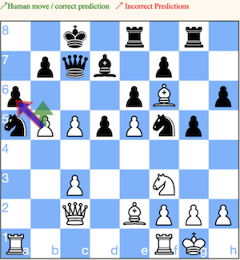
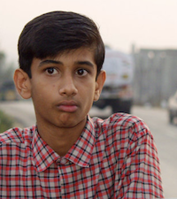

# Maia Dashboard / anti-semicolon-semicolon-club

## Product Details
 
#### Q1: What are you planning to build?
We are planning to build an educational, fun and aesthetically pleasing web application 
in which users will be able to view and learn from their past chess games on [Lichess](https://lichess.org/). 

This application should be responsive and not limited to high end devices or internet connections. 
We plan to expose values computed by [CSSLab’s Maia Chess Project](https://maiachess.com/) in an intuitive 
and interactive way such that minimal effort is needed to navigate the website and derive strategies for improvement. 
For example, we will display a large chess board that will reflect the current board positions of a game. 
As users search through all board states, this chess board will update in real-time and use arrows 
and highlighted fields to showcase suboptimal play or interesting moves the user performed. 
Beyond allowing users to inspect single positions and games we will put a strong focus on providing an analysis 
of a user’s overall gameplay. To do this we plan to expose three key values: performance, entropy and trickiness. 

[Interactable Mockup](
https://angelyuan218063.invisionapp.com/prototype/ckuaa4ek700agth01x08c0nbw/play)

#### Q2: Who are your target users?
Committed chess players from all over the world that want to improve on their chess skills. 

|      | Amy, 26 (Lives in Australia)       **TECHNOLOGY/SKILLS:**  Chess ★★★★✩  Internet ★★★★★  AI ✩✩✩✩✩ | 
| :---:       |    :----:   | 
| **BIO**         | Amy learned chess from her parents as a child. She has a regular 9 to 6 job. She has a stable but limited income. A stable relationship with her boyfriend. Chess is her hobby and she enjoys using her free time to play a few games online. She finds playing online is easily accessible, easy to find opponents, and meet up with her friends. She mainly plays with her phone and sometimes with her computer. | 
| **NEEDS**   | She has felt like she reached a bottleneck in chess and wants to improve her skills. She wants a platform to provide her feedback and help her learn and improve.       | 
| **FRUSTRATION**   | She is only willing to spend a very limited amount of money and is not willing to spend too much time. She wants the feedback to be easily accessible and specific to her.       | 

|      | Oliver, 14 (Lives in India)       **TECHNOLOGY/SKILLS:**  Chess ★★★✩✩  Internet ★★✩✩✩  AI ✩✩✩✩✩ | 
| :---:       |    :----:   | 
| **BIO**         | Oliver lives with his family. He does not have his own phone or computer, but sometimes he gets to use his mother’s phone. The usage is very restricted and he does not have good internet connections. He discovered chess from one of his friends and after learning the rules got very interested in it. He later discovered that he can play chess online. | 
| **NEEDS**   | When he was looking at the history of games he played, he discovered that he has been losing a lot. Oliver would like to get better at chess.      | 
| **FRUSTRATION**   | He can’t spend money on this and can’t spend a lot of time. The internet he uses is very unstable. Sometimes it becomes very slow and takes a long time for the page to respond.  | 

#### Q3: Why would your users choose your product? What are they using today to solve their problem/need?
There are a lot of existing superhuman chess engines such as Stockfish that exist in the chess community. And there exist online platforms such as lichess that provide game-level feedback using those chess engines to the users. These platforms are currently used by users to help them improve on their chess skills. However, there are problems with these existing platforms that will cause a user to choose our product instead.

First, the optimal plays that those chess engines generate are often uninterpretable to a human user (as shown from our partner’s research). Since the human user can’t understand why the AI made those plays in the first place, it is hard for the user to learn from those plays and feedback. However, the AI (MAIA) our product will be using takes this in mind and produces human-like optimal plays that our user can understand and learn from. The user can more easier understand the feedback our product provide and more easier learn from it.

Second, the current platforms are lacking the ability to find mistakes, interesting moves, tricky moves, from an user’s game history. They are often focused on a specific game and only provide game-leve feedback. Our product goes beyond that and provide state-level feedback and general-level feedback. Also, the user can just search for something like their mistakes and it will display mistakes the user made from a range of games the user played in the past. Something other platforms does not provide. This is much easier for the user to use and see their mistakes and learn from their mistakes. The user will get a wider range of feedback specific to them that will help in their learning.

Our partner’s mission is to create an AI that acts as an algorithmic teaching tool to human users. Our project provides a platform to display the current AI our partner has and gather data from the users so our partner can use it in their research.

#### Q4: How will you build it?

**TECHNOLOGY STACK**
* **Backend:** (pure) Python
    * Our team offered to use either pure Python or Django with Redis Message Queue for the backend to the Partner. The partner prefers to use pure Python. 
* **Frontend:** React
    * The partner's other projects are built in React. We decided to use React for Maia Dashboard as well to keep consistency between the partner's projects. 
* **Database:** MongoDB
    * The partner chose to use MongoDB because: 
        * MongoDB requires less memory than a relational database.
        * Partner prefers storing data as a JSON to make it easier to retrieve the data.
        * Partner uses MongoDB for their other projects.
* **API:** FastAPI
    * The partner is familiar with the FastAPI technology and used it previously for other projects. We chose to use FastAPI to make the project support easier for the partner.
* **Third-party API:** [Lichess API](https://lichess.org/api) 
    * Lichess API will be used to autheticate users and retrieve user games data for analysis.
* **CI/CD:** GitHub Actions
    * All our team members practiced using GitHub Actions for A1 so now it seems like a safe choice of CI/CD technology.
* **Hosting:** Azure
    * The hosting is provided by the partner.
* **Web Server:** Nginx 
* **Python Web Server Gateway Interface HTTP server:** Gunicorn 

**ARCHITECTURE**

Frontend will communicate with the backend through the API, the real API endpoints will be hidden. 
Backend will communicate with the Database through a separate API. 
When Maia Dashboard needs to retrieve data from Lichess, Maia Dashboard API will call Lichess API.

Please see a Sequence Diagram below for details on each flow.

**Sequence Diagram** (Please click on the diagram to see it in detail.)
[![](https://mermaid.ink/img/eyJjb2RlIjoic2VxdWVuY2VEaWFncmFtXG4gICAgYXV0b251bWJlclxuICAgIGFjdG9yIHVzZXIgYXMgVXNlclxuICAgIHBhcnRpY2lwYW50IGZlIGFzIFJlYWN0PGJyLz5Gcm9udGVuZFxuICAgIHBhcnRpY2lwYW50IGJlIGFzIEJhY2tlbmRcbiAgICBwYXJ0aWNpcGFudCBhcGkgYXMgRmFzdEFQSVxuICAgIHBhcnRpY2lwYW50IGxpY2hlc3MgYXMgTGljaGVzc1xuICAgIHBhcnRpY2lwYW50IGVuZ2luZSBhcyBBbmFseXNpczxici8-TG9naWNcbiAgICBwYXJ0aWNpcGFudCBkYiBhcyBNb25nb0RCXG5cbiAgICBub3RlIG92ZXIgdXNlciwgZGI6IExvZ2luIHdpdGggTGljaGVzc1xuICAgIHVzZXIgLT4-KyBmZTogbG9naW4gd2l0aCBsaWNoZXNzXG4gICAgZmUgLT4-KyBiZTogbG9naW4gd2l0aCBsaWNoZXNzXG4gICAgYmUgLT4-KyBsaWNoZXNzOiBQYXJ0bmVyIHRvIHByb3ZpZGUgZGV0YWlsc1xuICAgIFxuXG4gICAgbm90ZSBvdmVyIHVzZXIsIGRiOiBOZXcgdXNlciAtIFB1bGwgdXNlciBkYXRhIGZyb20gTGljaGVzcywgc3RvcmUgaW4gTWFpYSBEYXNoYm9hcmQgREIgYW5kIHJldHVybiB0byBGRVxuICAgIGZlIC0-PisgYmU6IGdldCB1c2VyIGRhdGEgIFxuICAgIGJlIC0-PisgYXBpOiBnZXQgdXNlciBkYXRhIGZyb20gREJcbiAgICBhcGkgLT4-KyBkYjogcHVsbCB1c2VyIGRhdGFcbiAgICBkYiAtLT4-KyBhcGk6IHJldHVybiA0MDQgIFxuICAgIGFwaSAtPj4rIGxpY2hlc3M6IHB1bGwgdXNlciBkYXRhIGFuZCBhbGwgZ2FtZXNcbiAgICBsaWNoZXNzIC0tPj4tIGFwaTogdXNlciBkYXRhICYgYWxsIGdhbWVzIHJlc3BvbnNlXG4gICAgYXBpIC0-PisgZGI6IHN0b3JlIHVzZXIgZGF0YSAmIGdhbWVzIHdpdGggc3RhdHVzIFwicGVuZGluZ1wiXG4gICAgZGIgLS0-Pi0gYXBpOiBva1xuICAgIGFwaSAtLT4-LSBiZTogcmV0dXJuIHVzZXIgZGF0YSAmIGdhbWVzXG4gICAgYmUgLS0-Pi0gZmU6IHJldHVybiB1c2VyIGRhdGEgJiBnYW1lc1xuXG5cbiAgICBub3RlIG92ZXIgdXNlciwgZGI6IEV4aXN0aW5nIHVzZXIgLSBHZXQgdXNlciBkYXRhIGZyb20gTWFpYSBEYXNoYm9hcmQgREJcbiAgICBmZSAtPj4rIGJlOiBnZXQgdXNlciBkYXRhXG4gICAgYmUgLT4-KyBhcGk6IGdldCB1c2VyIGRhdGEgZnJvbSBEQlxuICAgIGFwaSAtPj4rIGRiOiBwdWxsIHVzZXIgZGF0YVxuICAgIGRiIC0tPj4rIGFwaTogcmV0dXJuIHVzZXIgZGF0YSAmIGdhbWVzXG4gICAgYXBpIC0tPj4tIGJlOiByZXR1cm4gdXNlciBkYXRhICYgZ2FtZXNcbiAgICBiZSAtLT4-LSBmZTogcmV0dXJuIHVzZXIgZGF0YSAmIGdhbWVzXG5cblxuICAgIG5vdGUgb3ZlciB1c2VyLCBkYjogTmV3IHVzZXIgLSBBbmFseXplIHVzZXIgZGF0YVxuICAgIGZlIC0-PisgYmU6IHRyaWdnZXJzIHVzZXIgZGF0YSBhbmFseXNpc1xuICAgIGJlIC0-PisgYXBpOiBnZXQgdXNlciBkYXRhIGFuYWx5dGljcyBmcm9tIHRoZSBEQlxuICAgIGFwaSAtPj4rIGVuZ2luZTogYW5hbHl6ZSB1c2VyIGRhdGEgXG4gICAgZW5naW5lIC0-PisgZGI6IHF1ZXJ5IHVzZXIgZGF0YSAmIGdhbWVzXG4gICAgZGIgLS0-Pi0gZW5naW5lOiB1c2VyIGRhdGEgJiBnYW1lc1xuICAgIGVuZ2luZSAtPj4gZW5naW5lOiBhbmFseXplIGRhdGFcbiAgICBlbmdpbmUgLT4-KyBkYjogc3RvcmUgc3RhdGlzdGljcyBpbiBEQiBhbmQgY2hhbmdlIHN0YXR1cyB0byBcImFuYWx5emVkXCJcbiAgICBkYiAtLT4-LSBlbmdpbmU6IG9rXG4gICAgZW5naW5lIC0tPj4tIGFwaTogcmV0dXJuIGRpY3Rpb25hcnkgd2l0aCBhbmFseXNpcyBkYXRhXG4gICAgYXBpIC0tPj4tIGJlOiByZXR1cm4gZGljdGlvbmFyeSB3aXRoIGFuYWx5c2lzIGRhdGFcbiAgICBiZSAtLT4-LSBmZTogcmV0dXJuIGRpY3Rpb25hcnkgd2l0aCBhbmFseXNpcyBkYXRhXG5cblxuICAgIG5vdGUgb3ZlciB1c2VyLCBkYjogRXhpc3RpbmcgdXNlciAtIFVzZXIgcmVxdWVzdCB0aGVpciBzdGF0c1xuICAgIHVzZXIgLT4-KyBmZTogZ2V0IGFuYWx5c2lzIGRhdGEgZm9yIHVzZXJcbiAgICBmZSAtPj4rIGJlOiBnZXQgYW5hbHlzaXMgZGF0YSBmb3IgdXNlclxuICAgIGJlIC0-PisgYXBpOiBnZXQgdXNlciBkYXRhIGFuYWx5dGljcyBmcm9tIHRoZSBEQlxuICAgIGFwaSAtPj4rIGRiOiBnZXQgdXNlciBzdGF0c1xuICAgIGRiIC0tPj4tIGFwaTogdXNlciBzdGF0cyBkYXRhXG4gICAgYXBpIC0-PiBhcGk6IHBhcnNlIGRhdGEgZm9yIEZFXG4gICAgYXBpIC0tPj4tIGJlOiB1c2VyIHN0YXRzXG4gICAgYmUgLS0-Pi0gZmU6IHVzZXIgc3RhdHNcbiAgICBmZSAtPj4tIGZlOiBidWlsZCBVSSBmb3Igc3RhdHNcblxuXG4gICAgbm90ZSBvdmVyIHVzZXIsIGRiOiBVc2VyIHNlbmRzIGZlZWRiYWNrXG4gICAgdXNlciAtPj4rIGZlOiBzZW5kIGZlZWRiYWNrXG4gICAgZmUgLT4-KyBiZTogc3RvcmUgZmVlZGJhY2tcbiAgICBiZSAtPj4rIGFwaTogc3RvcmUgZmVlZGJhY2sgaW4gdGhlIERCXG4gICAgYXBpIC0-PisgZGI6IHN0b3JlIHVzZXIgZmVlZGJhY2tcbiIsIm1lcm1haWQiOnsidGhlbWUiOiJkYXJrIn0sInVwZGF0ZUVkaXRvciI6ZmFsc2UsImF1dG9TeW5jIjp0cnVlLCJ1cGRhdGVEaWFncmFtIjpmYWxzZX0)](https://mermaid.live/edit/#eyJjb2RlIjoic2VxdWVuY2VEaWFncmFtXG4gICAgYXV0b251bWJlclxuICAgIGFjdG9yIHVzZXIgYXMgVXNlclxuICAgIHBhcnRpY2lwYW50IGZlIGFzIFJlYWN0PGJyLz5Gcm9udGVuZFxuICAgIHBhcnRpY2lwYW50IGJlIGFzIEJhY2tlbmRcbiAgICBwYXJ0aWNpcGFudCBhcGkgYXMgRmFzdEFQSVxuICAgIHBhcnRpY2lwYW50IGxpY2hlc3MgYXMgTGljaGVzc1xuICAgIHBhcnRpY2lwYW50IGVuZ2luZSBhcyBBbmFseXNpczxici8-TG9naWNcbiAgICBwYXJ0aWNpcGFudCBkYiBhcyBNb25nb0RCXG5cbiAgICBub3RlIG92ZXIgdXNlciwgZGI6IExvZ2luIHdpdGggTGljaGVzc1xuICAgIHVzZXIgLT4-KyBmZTogbG9naW4gd2l0aCBsaWNoZXNzXG4gICAgZmUgLT4-KyBiZTogbG9naW4gd2l0aCBsaWNoZXNzXG4gICAgYmUgLT4-KyBsaWNoZXNzOiBQYXJ0bmVyIHRvIHByb3ZpZGUgZGV0YWlsc1xuICAgIFxuXG4gICAgbm90ZSBvdmVyIHVzZXIsIGRiOiBOZXcgdXNlciAtIFB1bGwgdXNlciBkYXRhIGZyb20gTGljaGVzcywgc3RvcmUgaW4gTWFpYSBEYXNoYm9hcmQgREIgYW5kIHJldHVybiB0byBGRVxuICAgIGZlIC0-PisgYmU6IGdldCB1c2VyIGRhdGEgIFxuICAgIGJlIC0-PisgYXBpOiBnZXQgdXNlciBkYXRhIGZyb20gREJcbiAgICBhcGkgLT4-KyBkYjogcHVsbCB1c2VyIGRhdGFcbiAgICBkYiAtLT4-KyBhcGk6IHJldHVybiA0MDQgIFxuICAgIGFwaSAtPj4rIGxpY2hlc3M6IHB1bGwgdXNlciBkYXRhIGFuZCBhbGwgZ2FtZXNcbiAgICBsaWNoZXNzIC0tPj4tIGFwaTogdXNlciBkYXRhICYgYWxsIGdhbWVzIHJlc3BvbnNlXG4gICAgYXBpIC0-PisgZGI6IHN0b3JlIHVzZXIgZGF0YSAmIGdhbWVzIHdpdGggc3RhdHVzIFwicGVuZGluZ1wiXG4gICAgZGIgLS0-Pi0gYXBpOiBva1xuICAgIGFwaSAtLT4-LSBiZTogcmV0dXJuIHVzZXIgZGF0YSAmIGdhbWVzXG4gICAgYmUgLS0-Pi0gZmU6IHJldHVybiB1c2VyIGRhdGEgJiBnYW1lc1xuXG5cbiAgICBub3RlIG92ZXIgdXNlciwgZGI6IEV4aXN0aW5nIHVzZXIgLSBHZXQgdXNlciBkYXRhIGZyb20gTWFpYSBEYXNoYm9hcmQgREJcbiAgICBmZSAtPj4rIGJlOiBnZXQgdXNlciBkYXRhXG4gICAgYmUgLT4-KyBhcGk6IGdldCB1c2VyIGRhdGEgZnJvbSBEQlxuICAgIGFwaSAtPj4rIGRiOiBwdWxsIHVzZXIgZGF0YVxuICAgIGRiIC0tPj4rIGFwaTogcmV0dXJuIHVzZXIgZGF0YSAmIGdhbWVzXG4gICAgYXBpIC0tPj4tIGJlOiByZXR1cm4gdXNlciBkYXRhICYgZ2FtZXNcbiAgICBiZSAtLT4-LSBmZTogcmV0dXJuIHVzZXIgZGF0YSAmIGdhbWVzXG5cblxuICAgIG5vdGUgb3ZlciB1c2VyLCBkYjogTmV3IHVzZXIgLSBBbmFseXplIHVzZXIgZGF0YVxuICAgIGZlIC0-PisgYmU6IHRyaWdnZXJzIHVzZXIgZGF0YSBhbmFseXNpc1xuICAgIGJlIC0-PisgYXBpOiBnZXQgdXNlciBkYXRhIGFuYWx5dGljcyBmcm9tIHRoZSBEQlxuICAgIGFwaSAtPj4rIGVuZ2luZTogYW5hbHl6ZSB1c2VyIGRhdGEgXG4gICAgZW5naW5lIC0-PisgZGI6IHF1ZXJ5IHVzZXIgZGF0YSAmIGdhbWVzXG4gICAgZGIgLS0-Pi0gZW5naW5lOiB1c2VyIGRhdGEgJiBnYW1lc1xuICAgIGVuZ2luZSAtPj4gZW5naW5lOiBhbmFseXplIGRhdGFcbiAgICBlbmdpbmUgLT4-KyBkYjogc3RvcmUgc3RhdGlzdGljcyBpbiBEQiBhbmQgY2hhbmdlIHN0YXR1cyB0byBcImFuYWx5emVkXCJcbiAgICBkYiAtLT4-LSBlbmdpbmU6IG9rXG4gICAgZW5naW5lIC0tPj4tIGFwaTogcmV0dXJuIGRpY3Rpb25hcnkgd2l0aCBhbmFseXNpcyBkYXRhXG4gICAgYXBpIC0tPj4tIGJlOiByZXR1cm4gZGljdGlvbmFyeSB3aXRoIGFuYWx5c2lzIGRhdGFcbiAgICBiZSAtLT4-LSBmZTogcmV0dXJuIGRpY3Rpb25hcnkgd2l0aCBhbmFseXNpcyBkYXRhXG5cblxuICAgIG5vdGUgb3ZlciB1c2VyLCBkYjogRXhpc3RpbmcgdXNlciAtIFVzZXIgcmVxdWVzdCB0aGVpciBzdGF0c1xuICAgIHVzZXIgLT4-KyBmZTogZ2V0IGFuYWx5c2lzIGRhdGEgZm9yIHVzZXJcbiAgICBmZSAtPj4rIGJlOiBnZXQgYW5hbHlzaXMgZGF0YSBmb3IgdXNlclxuICAgIGJlIC0-PisgYXBpOiBnZXQgdXNlciBkYXRhIGFuYWx5dGljcyBmcm9tIHRoZSBEQlxuICAgIGFwaSAtPj4rIGRiOiBnZXQgdXNlciBzdGF0c1xuICAgIGRiIC0tPj4tIGFwaTogdXNlciBzdGF0cyBkYXRhXG4gICAgYXBpIC0-PiBhcGk6IHBhcnNlIGRhdGEgZm9yIEZFXG4gICAgYXBpIC0tPj4tIGJlOiB1c2VyIHN0YXRzXG4gICAgYmUgLS0-Pi0gZmU6IHVzZXIgc3RhdHNcbiAgICBmZSAtPj4tIGZlOiBidWlsZCBVSSBmb3Igc3RhdHNcblxuXG4gICAgbm90ZSBvdmVyIHVzZXIsIGRiOiBVc2VyIHNlbmRzIGZlZWRiYWNrXG4gICAgdXNlciAtPj4rIGZlOiBzZW5kIGZlZWRiYWNrXG4gICAgZmUgLT4-KyBiZTogc3RvcmUgZmVlZGJhY2tcbiAgICBiZSAtPj4rIGFwaTogc3RvcmUgZmVlZGJhY2sgaW4gdGhlIERCXG4gICAgYXBpIC0-PisgZGI6IHN0b3JlIHVzZXIgZmVlZGJhY2tcbiIsIm1lcm1haWQiOiJ7XG4gIFwidGhlbWVcIjogXCJkYXJrXCJcbn0iLCJ1cGRhdGVFZGl0b3IiOmZhbHNlLCJhdXRvU3luYyI6dHJ1ZSwidXBkYXRlRGlhZ3JhbSI6ZmFsc2V9)

Please see a Server Diagram below for details on the servers setup.

**Server Diagram** (Please click on the diagram to see it in detail.)
[![](https://mermaid.ink/img/eyJjb2RlIjoiZmxvd2NoYXJ0IExSXG4gICAgdXNlcltVc2VyXSAtLT58ZW50ZXJzIFVSTHwgd2ViW0Jyb3dzZXJdXG4gICAgd2ViIC0tPnxwb3J0IDgwfCBuZ2lueFtXZWIgU2VydmVyPGJyLz5uZ2lueF1cbiAgICB3ZWIgLS0-fHBvcnQgWHwgbmdpbnhbV2ViIFNlcnZlcjxici8-bmdpbnhdXG4gICAgXG4gICAgc3ViZ3JhcGggc2VydmVyW1NlcnZlciBWTV1cbiAgICAgICAgZGlyZWN0aW9uIFRCICAgICAgIFxuICAgICAgICBzdWJncmFwaCBndW5pY29ybi1wcm9kW0d1bmljb3JuIFBST0RdXG4gICAgICAgICAgICBiZS1wW0JhY2tlbmQgUHl0aG9uXSAtLT4gYXBpLXBbRmFzdEFQSV1cbiAgICAgICAgICAgIGFwaS1wIC0tPiBsb2dpYy1wW1N0YXRzIEFuYWx5dGljcyBMb2dpY11cbiAgICAgICAgICAgIGxvZ2ljLXAgLS4tPiBhcGktcFxuICAgICAgICAgICAgYXBpLXAgLS0-IHxNb25nb0RCfCBkYi1wW0RhdGFiYXNlXVxuICAgICAgICBlbmRcbiAgICAgICAgc3ViZ3JhcGggZ3VuaWNvcm4tZGV2W0d1bmljb3JuIERFVl1cbiAgICAgICAgICAgIGJlLWRbQmFja2VuZCBQeXRob25dIC0tPiBhcGktZFtGYXN0QVBJXVxuICAgICAgICAgICAgYXBpLWQgLS0-IGxvZ2ljLWRbU3RhdHMgQW5hbHl0aWNzIExvZ2ljXVxuICAgICAgICAgICAgbG9naWMtZCAtLi0-IGFwaS1kICAgICAgIFxuICAgICAgICAgICAgYXBpLWQgLS0-IHxNb25nb0RCfCBkYi1kW0RhdGFiYXNlXVxuICAgICAgICBlbmRcbiAgICAgICAgbmdpbnggLS0-fGZvciByZWFjdCBzdGF0aWMgPGJyLz4gaHRtbC9qcy9jc3MgZmlsZXN8IHN0YXRpYy1wcm9kICYgc3RhdGljLWRldlxuICAgICAgICBuZ2lueCAtLT4gZ3VuaWNvcm4tcHJvZCAmIGd1bmljb3JuLWRldlxuICAgIGVuZFxuICAgIGFwaS1wICYgYXBpLWQgLS0-fExpY2hlc3MgQVBJfCBsaWNoZXNzIiwibWVybWFpZCI6eyJ0aGVtZSI6ImRhcmsifSwidXBkYXRlRWRpdG9yIjpmYWxzZSwiYXV0b1N5bmMiOnRydWUsInVwZGF0ZURpYWdyYW0iOmZhbHNlfQ)](https://mermaid.live/edit/#eyJjb2RlIjoiZmxvd2NoYXJ0IExSXG4gICAgdXNlcltVc2VyXSAtLT58ZW50ZXJzIFVSTHwgd2ViW0Jyb3dzZXJdXG4gICAgd2ViIC0tPnxwb3J0IDgwfCBuZ2lueFtXZWIgU2VydmVyPGJyLz5uZ2lueF1cbiAgICB3ZWIgLS0-fHBvcnQgWHwgbmdpbnhbV2ViIFNlcnZlcjxici8-bmdpbnhdXG4gICAgXG4gICAgc3ViZ3JhcGggc2VydmVyW1NlcnZlciBWTV1cbiAgICAgICAgZGlyZWN0aW9uIFRCICAgICAgIFxuICAgICAgICBzdWJncmFwaCBndW5pY29ybi1wcm9kW0d1bmljb3JuIFBST0RdXG4gICAgICAgICAgICBiZS1wW0JhY2tlbmQgUHl0aG9uXSAtLT4gYXBpLXBbRmFzdEFQSV1cbiAgICAgICAgICAgIGFwaS1wIC0tPiBsb2dpYy1wW1N0YXRzIEFuYWx5dGljcyBMb2dpY11cbiAgICAgICAgICAgIGxvZ2ljLXAgLS4tPiBhcGktcFxuICAgICAgICAgICAgYXBpLXAgLS0-IHxNb25nb0RCfCBkYi1wW0RhdGFiYXNlXVxuICAgICAgICBlbmRcbiAgICAgICAgc3ViZ3JhcGggZ3VuaWNvcm4tZGV2W0d1bmljb3JuIERFVl1cbiAgICAgICAgICAgIGJlLWRbQmFja2VuZCBQeXRob25dIC0tPiBhcGktZFtGYXN0QVBJXVxuICAgICAgICAgICAgYXBpLWQgLS0-IGxvZ2ljLWRbU3RhdHMgQW5hbHl0aWNzIExvZ2ljXVxuICAgICAgICAgICAgbG9naWMtZCAtLi0-IGFwaS1kICAgICAgIFxuICAgICAgICAgICAgYXBpLWQgLS0-IHxNb25nb0RCfCBkYi1kW0RhdGFiYXNlXVxuICAgICAgICBlbmRcbiAgICAgICAgbmdpbnggLS0-fGZvciByZWFjdCBzdGF0aWMgPGJyLz4gaHRtbC9qcy9jc3MgZmlsZXN8IHN0YXRpYy1wcm9kICYgc3RhdGljLWRldlxuICAgICAgICBuZ2lueCAtLT4gZ3VuaWNvcm4tcHJvZCAmIGd1bmljb3JuLWRldlxuICAgIGVuZFxuICAgIGFwaS1wICYgYXBpLWQgLS0-fExpY2hlc3MgQVBJfCBsaWNoZXNzIiwibWVybWFpZCI6IntcbiAgXCJ0aGVtZVwiOiBcImRhcmtcIlxufSIsInVwZGF0ZUVkaXRvciI6ZmFsc2UsImF1dG9TeW5jIjp0cnVlLCJ1cGRhdGVEaWFncmFtIjpmYWxzZX0)

**DEPLOYMENT**

Deployment to `DEV` and `PROD` environments will be automated with GitHub Actions. 
GitHub Actions will run tests, 
compile React frontend code and copy the static files to the Azure server,
copy updated Python files to the Azure server, and then will restart Gunicorn on the server to show the updates.

On the event of a successful deployment or a deployment failure the team will be notified on Slack 
with an automatic Slack message.  

Please see the Deployment Diagram below for the deployment flow details.

**Deployment Diagram** (Please click on the diagram to see it in detail.)
[![](https://mermaid.ink/img/eyJjb2RlIjoiZmxvd2NoYXJ0IFRCXG4gICAgc3ViZ3JhcGggZGphbmdvW1Rlc3QgUHl0aG9uIGNvZGUgYW5kIGRlcGxveSBiYWNrZW5kXVxuICAgICAgICBkaXJlY3Rpb24gVEJcbiAgICAgICAgZGVwZW5kZW5jaWVzW0luc3RhbGwgcHl0aG9uIGRlcGVuZGVuY2llc10gLS0-IHRlc3RzW1J1biB0ZXN0c11cbiAgICAgICAgdGVzdHMgLS0-IGNvcHlbQ29weSBiYWNrZW5kL3B5dGhvbiBmaWxlc11cbiAgICAgICAgY29weSAtLT4gZ3VuaWNvcm5bUmVzdGFydCBndW5pY29ybiBzZXJ2aWNlIG9uIHNlcnZlcl1cbiAgICBlbmRcbiAgICBzdWJncmFwaCByZWFjdFtCdWlsZCBmcm9udGVudCBhbmQgZGVwbG95XVxuICAgICAgICBkaXJlY3Rpb24gVEJcbiAgICAgICByZWFjdF9kZXBlbmRlbmNpZXNbSW5zdGFsbCByZWFjdCBkZXBlbmRlbmNpZXNdIC0tPiBidWlsZFtSZWFjdCBidWlsZF1cbiAgICAgICBidWlsZCAtLT4gY29weV9mZVtDb3B5IHJlYWN0IGJ1aWxkIHRvIHNlcnZlcl1cbiAgICBlbmRcbiAgICBzdWJncmFwaCBzbGFja1tTbGFjayBub3RpZmljYXRpb25dXG4gICAgICAgIHhbTm90aWZ5IG9uIHN1Y2Nlc3NmdWwgZGVwbG95bWVudF1cbiAgICAgICAgLVtOb3RpZnkgb24gZGVwbG95bWVudCBmYWlsdXJlXVxuICAgICAgICBcbiAgICBlbmRcbiAgICB1c2VyW0RldmVsb3Blcl0gLS0-fHB1c2ggY29kZXwgZ2l0aHViW0dpdEh1YiA8YnIvPiBkZXZlbG9wICYgbWFzdGVyIDxici8-IGJyYW5jaGVzXVxuICAgIGdpdGh1YiAtLT58Z2l0aHViIGFjdGlvbiBqb2IgMXwgZGphbmdvXG4gICAgZ2l0aHViIC0tPnxnaXRodWIgYWN0aW9uIGpvYiAyfCByZWFjdFxuICAgIFxuICAgIHJlYWN0IC0tPiBzbGFja1xuICAgIGRqYW5nbyAtLT4gc2xhY2tcblxuICAgIGNvcHlfZmUgLS4tIGNvbW1lbnRbRW52aXJvbm1lbnQgZGVwZW5kYW50IG9uIGJyYW5jaF1cbiAgICBjb3B5IC0uLSBjb21tZW50XG4gICAgZ3VuaWNvcm4gLS4tIGNvbW1lbnRcbiAgIiwibWVybWFpZCI6eyJ0aGVtZSI6ImRhcmsifSwidXBkYXRlRWRpdG9yIjpmYWxzZSwiYXV0b1N5bmMiOnRydWUsInVwZGF0ZURpYWdyYW0iOmZhbHNlfQ)](https://mermaid.live/edit/#eyJjb2RlIjoiZmxvd2NoYXJ0IFRCXG4gICAgc3ViZ3JhcGggZGphbmdvW1Rlc3QgUHl0aG9uIGNvZGUgYW5kIGRlcGxveSBiYWNrZW5kXVxuICAgICAgICBkaXJlY3Rpb24gVEJcbiAgICAgICAgZGVwZW5kZW5jaWVzW0luc3RhbGwgcHl0aG9uIGRlcGVuZGVuY2llc10gLS0-IHRlc3RzW1J1biB0ZXN0c11cbiAgICAgICAgdGVzdHMgLS0-IGNvcHlbQ29weSBiYWNrZW5kL3B5dGhvbiBmaWxlc11cbiAgICAgICAgY29weSAtLT4gZ3VuaWNvcm5bUmVzdGFydCBndW5pY29ybiBzZXJ2aWNlIG9uIHNlcnZlcl1cbiAgICBlbmRcbiAgICBzdWJncmFwaCByZWFjdFtCdWlsZCBmcm9udGVudCBhbmQgZGVwbG95XVxuICAgICAgICBkaXJlY3Rpb24gVEJcbiAgICAgICByZWFjdF9kZXBlbmRlbmNpZXNbSW5zdGFsbCByZWFjdCBkZXBlbmRlbmNpZXNdIC0tPiBidWlsZFtSZWFjdCBidWlsZF1cbiAgICAgICBidWlsZCAtLT4gY29weV9mZVtDb3B5IHJlYWN0IGJ1aWxkIHRvIHNlcnZlcl1cbiAgICBlbmRcbiAgICBzdWJncmFwaCBzbGFja1tTbGFjayBub3RpZmljYXRpb25dXG4gICAgICAgIHhbTm90aWZ5IG9uIHN1Y2Nlc3NmdWwgZGVwbG95bWVudF1cbiAgICAgICAgLVtOb3RpZnkgb24gZGVwbG95bWVudCBmYWlsdXJlXVxuICAgICAgICBcbiAgICBlbmRcbiAgICB1c2VyW0RldmVsb3Blcl0gLS0-fHB1c2ggY29kZXwgZ2l0aHViW0dpdEh1YiA8YnIvPiBkZXZlbG9wICYgbWFzdGVyIDxici8-IGJyYW5jaGVzXVxuICAgIGdpdGh1YiAtLT58Z2l0aHViIGFjdGlvbiBqb2IgMXwgZGphbmdvXG4gICAgZ2l0aHViIC0tPnxnaXRodWIgYWN0aW9uIGpvYiAyfCByZWFjdFxuICAgIFxuICAgIHJlYWN0IC0tPiBzbGFja1xuICAgIGRqYW5nbyAtLT4gc2xhY2tcblxuICAgIGNvcHlfZmUgLS4tIGNvbW1lbnRbRW52aXJvbm1lbnQgZGVwZW5kYW50IG9uIGJyYW5jaF1cbiAgICBjb3B5IC0uLSBjb21tZW50XG4gICAgZ3VuaWNvcm4gLS4tIGNvbW1lbnRcbiAgIiwibWVybWFpZCI6IntcbiAgXCJ0aGVtZVwiOiBcImRhcmtcIlxufSIsInVwZGF0ZUVkaXRvciI6ZmFsc2UsImF1dG9TeW5jIjp0cnVlLCJ1cGRhdGVEaWFncmFtIjpmYWxzZX0)

**TESTING**

For testing we will use unit tests. 
Before a developer creates a Pull Request, this developer needs to write tests for their code 
and run existing tests to verify that their code has not broken any existing funnctionality.

#### Q5: What are the user stories that make up the MVP?
Please open [Google Slides here](https://docs.google.com/presentation/d/1V2gnUiMgze4BJ1yaO9ueb0veCmzg0P37orXA-_0MsZc/edit?usp=sharing) to see Maia Dashboard user stories.

----
## Intellectual Property Confidentiality Agreement 

Licence: GPL

----

## Process Details

#### Q6: What are the roles & responsibilities on the team?
**TECHNICAL ROLES**
* Backend Dev
* Frontend Dev
* Full Stack Dev
* DevOps 
* Architect

**NON-TECHNICAL ROLES**
* Project Manager
    * Create Project Roadmap
    * Set Project Milestones & Deadlines
    * Plan sprints together with the Scrum Master
    * Be responsible for the project delivery by the deadline: contact developers and make sure that they are delivering their tickets functionality by the deadline
    * Organize and schedule meetings
* Product Manager
    * Define the product and all its features
    * Make sure that the product we are going to build is exactly what the client wants
    * Manage client expectations (don’t overpromise!)
    * Work with Systems Analyst to define business requirements and create Trello tickets
    * Be responsible for the client being happy with the product
* Systems Analyst
    * Translate business requirements into technical requirements and create Trello tickets
    * Estimate tickets with developers
    * Work with Product Manager to ensure that whatever the client wants is actually technically possible
    * If something is technically impossible to build, inform the Product Manager & client
* UI/UX Designer
    * Work with Product Manager & client to define the product UI/UX
    * Make / draw wireframes
* Writing Meeting Minutes
    * Write meeting minutes and email them to the team and the client after every meeting
* Scrum Master
    * Define sprints together with Project Manager
    * Lead standup meetings

| Team member:      |  Sina Abady | 
| :---:        |    :----:   |
| Role(s) Responsibilities |   Full Stack Dev (Focus on Backend)     | 
| Component worked on   |     *D1:* Highlights section     *Future deliverables:*   - Develop REST API for backend-analysis logic communication   - Integrate the analysis logic into the backend implementation    | 
| Non software related work   |    Supervises the note taking process shared by all team members     | 
| 3 technical strengths and weaknesses  |   Strengths:   - Back-end server side programming   - Algorithms & Runtime Optimizations   - AI & NNs      *Weaknesses:*   - Frontend UI/UX Design   - CI/CD deployments and workflows   - Multi-Page Websites    | 

:small_orange_diamond:

| Team member:      | Robin Gerster | 
| :---:        |    :----:   |
| Role(s) Responsibilities |    - Full Stack (focus on frontend)   - UI/UX Designer   - Product Manager    | 
| Component worked on   |   *D1:* Q1 section     *Future deliverables:*   - Develop frontend for a scrollable sorted list of games     - Develop a navigation bar   | 
| Non software related work   |     Acts as a Product Manager clarifying main product features    | 
| 3 technical strengths and weaknesses  |   *Strengths:*   - Python, C#   - AI   - UI/UX Design     *Weaknesses:*   - Javascript   - CI/CD deployments and workflows   - Lack of documentation/comments on code written.      | 

| Team member:      | Kevin Hong | 
| :---:        |    :----:   |
| Role(s) Responsibilities |   - Scrum master   - Full-Stack Developer     | 
| Component worked on   |    *D1:* Q9 section     *Future deliverables:*   - Develop REST API for frontend-backend communication    - Develop REST API for backend-database communication      | 
| Non software related work   |  Acts as a Scrum master planning one-week sprints   | 
| 3 technical strengths and weaknesses  |   *Strengths:*   - Have experience building full-stack web applications   - Have experience designing full end to end architecture of web applications   - Have experience with cloud computing solutions     *Weaknesses:*   - In-experienced with hosting web applications on local virtual machines   - Poor web application designing skills   - Weak code testing coverage on server related software      | 

| Team member:      | Natalia Moran | 
| :---:        |    :----:   |
| Role(s) Responsibilities |   - Full Stack Dev, DevoOps, Architect   - Systems Analyst     | 
| Component worked on   |     *D1:* Q4, Q5, Q6, Q7, and Q8 sections     *Future deliverables:*    - Configure CI/CD and Server   - Integrate with Lichess API   - Develop logging frontend activity   | 
| Non software related work   |    - Acts as a Systems Analyst translating business requirements into technical requirements    - Acts as a Project Manager in the absence of a Project Manager   | 
| 3 technical strengths and weaknesses  |    *Strengths:*   - Previous experience with Python, React, MongoDB, RestAPI Design   - Previous work experience as a Systems Analyst   - Good soft skills      *Weaknesses:*   - Minimal experience with CI/CD technology    - Minimal experience with planning an architecture   - Minimal knowledge of AI   | 

| Team member:      | William Wang | 
| :---:        |    :----:   |
| Role(s) Responsibilities |    - Full Stack (focus on frontend) Dev   - DevOps    | 
| Component worked on   |     *D1:* Highlights section     *Future deliverables:*    - Develop chess board visualization    - Develop suggested moves visualization    - Develop user account info visualization   | 
| Non software related work   |   - Acts as a UI/UX Designer preparing mockups and approving them with the partner      | 
| 3 technical strengths and weaknesses  |   *Strength:*   - HTML/CSS/JavaScript   - Data visualization   - Python     *Weaknesses:*   - React   - Inexperienced with the connection between frontend and backend   - Report writing      | 

| Team member:      | Angel Yuan | 
| :---:        |    :----:   |
| Role(s) Responsibilities |    - Full Stack (focus on frontend) Dev   - UI/UX Designer    | 
| Component worked on  |     *D1:* Q2, and Q3 sections     *Future deliverables:*    - Develop a filter for the most interesting positions, the most difficult positions, and mistakes, etc   - Develop a feedback form    | 
| Non software related work   |   - Acts as a UI/UX Designer preparing mockups and approving them with the partner       | 
| 3 technical strengths and weaknesses  |         | 

#### Q7: What operational events will you have as a team?

Describe meetings (and other events) you are planning to have. 
 * When and where? Recurring or ad hoc? In-person or online?
 * What's the purpose of each meeting?
 * Other events could be coding sessions, code reviews, quick weekly sync meeting online, etc.
 * You must have at least 2 meetings with your project partner (if you have one) before D1 is due. Describe them here:
   * What did you discuss during the meetings?
   * What were the outcomes of each meeting?
   * You must provide meeting minutes.
   * You must have a regular meeting schedule established by the second meeting.  
  
#### Q8: What artifacts will you use to self-organize?

List/describe the artifacts you will produce in order to organize your team.       

 * Artifacts can be To-Do lists, Task boards, schedule(s), meeting minutes, etc.
 * We want to understand:
   * How do you keep track of what needs to get done?
   * **How do you prioritize tasks?**
   * How do tasks get assigned to team members?
   * How do you determine the status of work from inception to completion?

#### Q9: What are the rules regarding how your team works?

Describe your team's working culture.

**Communications:**
 * What is the expected frequency? What methods/channels are appropriate? 
 * If you have a partner project, what is your process (in detail) for communicating with your partner?
 
**Meetings:**
 * How are people held accountable for attending meetings, completing action items? Is there a moderator or process?
 
**Conflict Resolution:**
 * List at least three team scenarios/conflicts you discussed in lecture and how you decided you will resolve them. Indecisions? Non-responsive team members? Any other scenarios you can think of?

----
## Highlights

Specify 3 - 5 key decisions and/or insights that came up during your meetings
and/or collaborative process.

 * Short (5 min' read max)
 * Decisions can be related to the product and/or the team process.
    * Mention which alternatives you were considering.
    * Present the arguments for each alternative.
    * Explain why the option you decided on makes the most sense for your team/product/users.
 * Essentially, we want to understand how (and why) you ended up with your current product and process plan.
 * This section is useful for important information regarding your decision making process that may not necessarily fit in other sections. 

----

### Partner Selection
After the group is formed, we first let each team member come up with their top three partners based on interest and abilities.
We soon found out that we have a shared interest in AI. Follow this theme, partners that we have considered includes:
 * [CSSLab](https://docs.google.com/document/d/1MHo_cUcqRSHbUD0DN9GiC2_6x4L1dvPczQQBnrCNg6U/edit)
 * [Software Engineering Lab](https://docs.google.com/document/d/1tdDwwwONTu_Il1r44tNMpEXWAi01XI6z3BMQmpwepYM/edit)
 * [TAGlab](https://docs.google.com/document/d/1zt4oJpi9BER3QMHpHB2m0is5pGxZ8BjUkaAof1oMznI/edit)

All of them involve building an interface to present an AI-related program.

 

Three votes are conducted on our discussion board to decide the rank of these partners, where we universally agree that CSSLab is our first partner of choice. The reasons behind this choice include interest in chess and the potential of learning from such research projects. 
New members who joined after the vote also agreed with CSSLab as the first choice. 

### Website Mockups
After the meeting with the Partner lead, Reid, we received a lot of interesting insights into the structure and look of the desired application.

Maia uses three major measures to quantify the ability of the user, the state of the game etc ...
 
 * **Performance:** Ratio between difficulty of the move and likeliness of player to play it
 * **Trickiness:** Defined as the expected-winrate loss for a given player. The trickier the player, the more they “outplay” this statistic, meaning they win when they are expected to lose in a position.
 * **Entropy:** This statistic describes the probabilistic complexity of a certain position. Will be toned down to be readable by the average user. Essentially   describes how complex the plays of a certain position can be.

 

Players will be able to select different interest postions within the game and analyze them via. the quantifiers provided by Maia.
They will be able to see the aggregate of their performance of the various games they uploaded, which will give the user a great insight to their game history. The suggestions for moves in interesting positions will be much more intuitive as Maia will match the moves to the skill level of the player and overall game. This interface will let any user, casual, or professional, gain great insight into the states of various games, and human actions in the games as well.

The scatter plot will allow more advanced users to compare the performance of Maia to Stockfish, on their winrate metrics, meaning the user can quantitatively and qualitatvely be able to compare Maia and Stockfish in real time!

### Teamwork :D

Our team is comprised of many different Computer Science majors from various walks of life. This means:
 * Our team is extremely dynamic in terms of its skillset
 * Is comprised of people with various interests in the field of CS
 * Has members ranging from 3rd year to 5th year of studies with various degrees of experience
 * We have the ability to learn from one another, and design solutions and applications in various interesting ways, pulling from our knowledge in either pure Computer Science course knowledge, Industry experince, and even hobby knowledge!
 * Due to this we are able to come up with various awesome designs, whether it comes to frontend GUI, backend multiprocessing etc...

Natalia has extremely in depth knowledge from industry in team collaboration, organization, and work flows, allowing our team to work extremely together, even with our hectic school schedules. 

 

Our frontend team comprising of Angel, William, and Robin have extensive experience in frontend ability, and are able to organize their ideas, make mockups, and collaborate effectively to come up with various design for the look of the website. They all ask detailed questions from the Partner to be able to interpret their wishes for the website, and get feedback as to provide an accurate to the Partner user experience.

 
 

Our backend team comprised of Natalia, Kevin and Sina, all have various knowledge of backend systems from Industry and school work. The meetings that occur between this team allows all three people to discuss various implementations of the API's based on personal experience, and provide pros and cons of different frameworks as it relates to the clients needs. This allows the team to quickly converge on not only, a near optimal solution for backend tech stack, but also learn a lot in the process!

 

 

