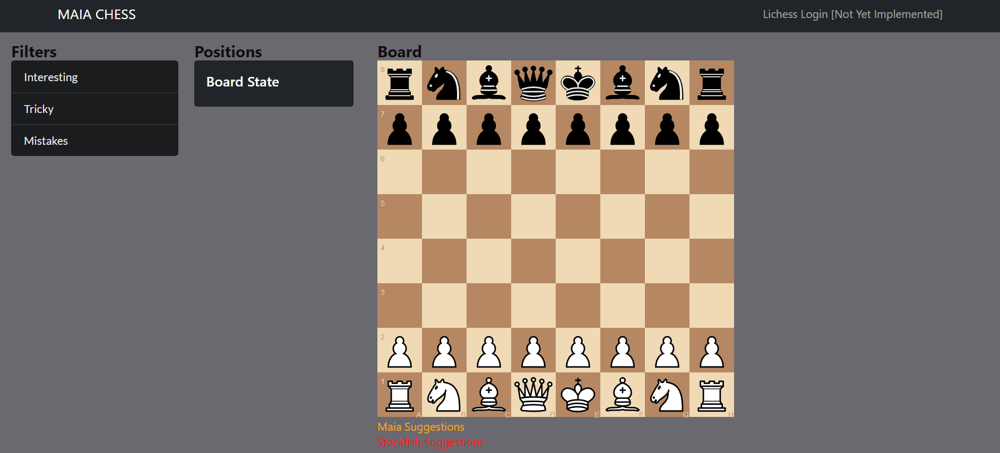
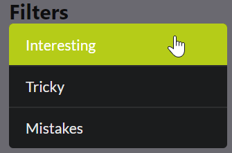
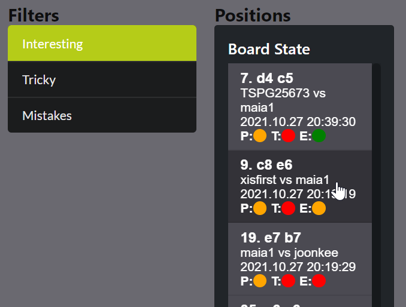
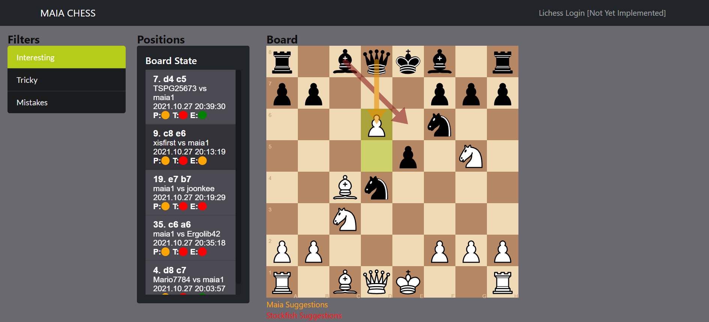
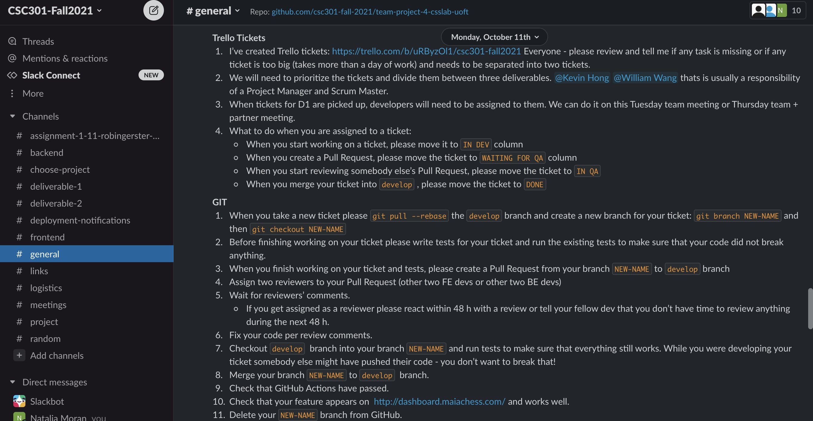
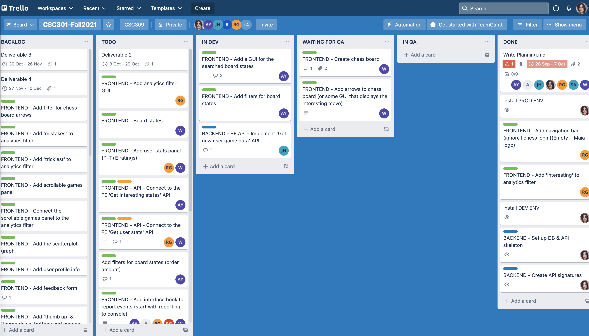

# Maia Dashboard / anti-semicolon-semicolon-club

> _Note:_ This document is intended to be relatively short. Be concise and precise. Assume the reader has no prior knowledge of your application and is non-technical. 

## Description 
 * Provide a high-level description of your application and it's value from an end-user's perspective
 * What is the problem you're trying to solve?
 * Is there any context required to understand **why** the application solves this problem?

## Key Features
For this deliverable, below is the complete set of features an user can access. Note that this features are connected with backend.
* Searching for interesting moves
  * After selecting "interesting" in the filter column, the page will search for interesting moves and display the result under the positions column.
* Searching for tricky moves
  * After selecting "tricky" in the filter column, the page will search for tricky moves and display the result under the positions column.
* Searching for mistakes
  * After selecting "mistakes" in the filter column, the page will search for mistakes moves and display the result under the positions column.
* Viewing a board state on the chessboard
  * The user can choose to view any of the board states by clicking on it. The state will then display on the chessboard.
* Viewing suggestions from the AIs
  * When a board state is displayed on the chessboard, arrows representing the suggestions by the AIs will be displayed as well. Each color representing the suggested move from a different AIs.
  
## Instructions
1. Go to the Maia Dashboard website http://dashboard.maiachess.com/ <br />

2. Select a filter you are interested in by click on one of the options.<br />

3. Now a list of board states from games played with the maia1 bot will be displayed under the positions column. Click on one from the list that you are interested to have a better look at.<br />

4. The game and state of the game is now displayed on the chessboard. Arrows representing the moves that the AIs suggests are also displayed on the chessboard.<br />


**Maia Dashboard website:** http://dashboard.maiachess.com/

### Testing the Backend API
**Maia Dashboard API docs:** http://dashboard.maiachess.com/api/docs 

The easiest (and recommended) way to test the Backend API currently is to use the link above
to make API calls. <br>
 
Currently the frontend connects to the "frontend" section of the API in the
docs above to pull data, and this will be supplemented with dashboard and analysis APIs in following 
deliverables. The analysis API is not required for this deliverable as it requires code from the partner
that generates the production data from real games, and is not a first priority for second deliverable. <br>

The Dashboard API showcases ability to get & write data to the backend, as well as search 
for users, register users, login to Lichess via OAuth, and pull Lichess games and profiles in real time. 

**Below are example ways to call the API. Feel free to use any other inputs you wish** <br>

*Posting Events*: The frontend can post any event they want for user logging. See an example below
 <br>

*Pulling Lichess User Profiles:* Request a user profile from Lichess and see all their stats. Maia1 (Partner account) is pulled below.
 <br>

*Adding a User:* Add a user to the database after the've been registered into the Maia system. Try registering a user that already exists for yourself :D 
 <br>

*Get User Data:* Pulls user data from the database
 <br>

*Lichess OAuth:* Users can login via. Lichess OAuth given they grab a key from their Lichess account. This speeds up game downloads. Team members account used below.
 <br>

*Logout:* This method "logs out" the user. Stubbed for now as we don't have official Maia accounts as of yet.
 <br>
 
## Development requirements
## Local environment installation guidelines
### Dependencies
In order to run this you need the following installed:
* docker
* python3.8
* virtualenv

### Clone project
Clone the project repository:
```
git clone git@github.com:csc301-fall-2021/team-project-4-csslab-uoft.git
```

### Create virtualenv
Follow instructions in `scripts/setup_local.sh` - run them from the project's top directory.

### Running mongodb container 
Install Docker and run from the top directory of the project:
```
docker-compose up
```
To test that it works, go to `http://localhost:27017` in your browser,
You should see a message: `It looks like you are trying to access MongoDB over HTTP on the native driver port.`.

If you do not see this message, something is wrong starting mongodb container.

If you want to reset the local mongo database: 
1. Terminate the `docker-compose` process.
2. Delete all files from `mongo_data` using this command:
   ```
   rm -rf mongo_data/*
   ```
   Notice there is a hidden file `.gitkeep` so the directory will be created when pulling from git - 
   Do not delete this file.

### Running backend
You can either run the server from the command line using this command from the `backend` directory:
```
uvicorn main:app --host 0.0.0.0 --port 8000
```

Or alternatively, you can run the `main.py` using your IDE.
If you wish to change the port the app is running on, you can change this line in `main.py`
```
uvicorn.run(app, host="0.0.0.0", port=8000) # << Change port
```

If you want your FastAPI to point to a different mongo database, you 
can set an environment variable `MONGODB_URL` to where you have your mongodb instance.

To check that your backend works, go to `http://localhost:8000/api/docs` - you should see the 
FastAPI openapi doc.

### Running frontend

From the `frontend` directory, run 
```
npm install
npm start
```
This will start the react app locally. 

 
 ## Deployment and Github Workflow

Before starting development our team agreed on a set of rules for working together. 


### Development environment deployment process 
We chose to adapt the following deployment process to recreate the best practices 
that we have seen in the IT industry during our co-op terms and full-time jobs 
as software developers, project managers and system analysts.

We believe in preventing conflicts by communicating with each other; 
our workflow is set to make each developer's working process as transparent as possible to other team members.
* Before starting developing we created a backlog of tasks in Trello 
and chose tickets for Deliverable-2 together with the partner.

* When a developer is assigned to a new task, she/he clarifies task requirements written in a Trello ticket.
* When a developer starts working on a new task, she/he moves the Trello ticket for this task to `IN DEV` column.
* The developer pulls updates from the `develop` branch: `git pull --rebase`
* The developer creates and checkouts a new branch for the task: 
```
git branch NEW-BRANCH
git checkout NEW-BRANCH
```
* While implementing the new functionality, the developer adds tests for it.
* Before creating a Pull Request the developer runs all tests to ensure that their code did not break any other functionality.
* When the new functionality is finalized and all tests pass, the developer creates a Pull Request from their branch `NEW-BRANCH` to `develop` branch.
* The developer assigns two reviewers to their Pull Request (other two frontend devs or other two backend devs) and moves the ticket to `WAITING FOR QA` column in Trello.
* Within 48h the reviewers should give their feedback on the Pull Request. 
While a developer is reviewing other developer's Pull Request, they move the Trello ticket to the `IN QA` column. 
* After receiving a code review feedback, the developer fixes their code in accordance with the review comments.
* The developer checkouts `develop` branch into their branch `NEW-BRANCH` and runs tests to make sure that everything still works 
(there might have been changes in the `develop` branch while the developer was working on their ticket).
* The developer merges their branch `NEW-BRANCH` to `develop` branch.
* The developer checks that GitHub Actions have passed.
* The developer checks that their feature is deployed to the [development environment](http://dash-dev.maiachess.com/) and works well there.
* The developer deletes their `NEW-BRANCH` branch from GitHub and moves the Trello ticket to the `DONE` column.


### Production environment deployment process 
Once in a few days Natalia (or other developer) merges `develop` branch into `main` branch 
and checks that all functionality works well in the [production environment](http://dashboard.maiachess.com/).

### CI/CD
During the Deliverable-1 we planned the CI/CD pipeline flow. 
We implemented the CI/CD as planned, using GitHub Actions and Azure hosting provided by the partner.

The only difference is that we used `uvicorn` instead of `gunicorn` service.

The following diagram was created for Deliverable-1 and used as a guideline for CI/CD development during Deliverable-2.

[![](https://mermaid.ink/img/eyJjb2RlIjoiZmxvd2NoYXJ0IFRCXG4gICAgc3ViZ3JhcGggZGphbmdvW1Rlc3QgUHl0aG9uIGNvZGUgYW5kIGRlcGxveSBiYWNrZW5kXVxuICAgICAgICBkaXJlY3Rpb24gVEJcbiAgICAgICAgZGVwZW5kZW5jaWVzW0luc3RhbGwgcHl0aG9uIGRlcGVuZGVuY2llc10gLS0-IHRlc3RzW1J1biB0ZXN0c11cbiAgICAgICAgdGVzdHMgLS0-IGNvcHlbQ29weSBiYWNrZW5kL3B5dGhvbiBmaWxlc11cbiAgICAgICAgY29weSAtLT4gZ3VuaWNvcm5bUmVzdGFydCBndW5pY29ybiBzZXJ2aWNlIG9uIHNlcnZlcl1cbiAgICBlbmRcbiAgICBzdWJncmFwaCByZWFjdFtCdWlsZCBmcm9udGVudCBhbmQgZGVwbG95XVxuICAgICAgICBkaXJlY3Rpb24gVEJcbiAgICAgICByZWFjdF9kZXBlbmRlbmNpZXNbSW5zdGFsbCByZWFjdCBkZXBlbmRlbmNpZXNdIC0tPiBidWlsZFtSZWFjdCBidWlsZF1cbiAgICAgICBidWlsZCAtLT4gY29weV9mZVtDb3B5IHJlYWN0IGJ1aWxkIHRvIHNlcnZlcl1cbiAgICBlbmRcbiAgICBzdWJncmFwaCBzbGFja1tTbGFjayBub3RpZmljYXRpb25dXG4gICAgICAgIHhbTm90aWZ5IG9uIHN1Y2Nlc3NmdWwgZGVwbG95bWVudF1cbiAgICAgICAgLVtOb3RpZnkgb24gZGVwbG95bWVudCBmYWlsdXJlXVxuICAgICAgICBcbiAgICBlbmRcbiAgICB1c2VyW0RldmVsb3Blcl0gLS0-fHB1c2ggY29kZXwgZ2l0aHViW0dpdEh1YiA8YnIvPiBkZXZlbG9wICYgbWFzdGVyIDxici8-IGJyYW5jaGVzXVxuICAgIGdpdGh1YiAtLT58Z2l0aHViIGFjdGlvbiBqb2IgMXwgZGphbmdvXG4gICAgZ2l0aHViIC0tPnxnaXRodWIgYWN0aW9uIGpvYiAyfCByZWFjdFxuICAgIFxuICAgIHJlYWN0IC0tPiBzbGFja1xuICAgIGRqYW5nbyAtLT4gc2xhY2tcblxuICAgIGNvcHlfZmUgLS4tIGNvbW1lbnRbRW52aXJvbm1lbnQgZGVwZW5kYW50IG9uIGJyYW5jaF1cbiAgICBjb3B5IC0uLSBjb21tZW50XG4gICAgZ3VuaWNvcm4gLS4tIGNvbW1lbnRcbiAgIiwibWVybWFpZCI6eyJ0aGVtZSI6ImRhcmsifSwidXBkYXRlRWRpdG9yIjpmYWxzZSwiYXV0b1N5bmMiOnRydWUsInVwZGF0ZURpYWdyYW0iOmZhbHNlfQ)](https://mermaid.live/edit/#eyJjb2RlIjoiZmxvd2NoYXJ0IFRCXG4gICAgc3ViZ3JhcGggZGphbmdvW1Rlc3QgUHl0aG9uIGNvZGUgYW5kIGRlcGxveSBiYWNrZW5kXVxuICAgICAgICBkaXJlY3Rpb24gVEJcbiAgICAgICAgZGVwZW5kZW5jaWVzW0luc3RhbGwgcHl0aG9uIGRlcGVuZGVuY2llc10gLS0-IHRlc3RzW1J1biB0ZXN0c11cbiAgICAgICAgdGVzdHMgLS0-IGNvcHlbQ29weSBiYWNrZW5kL3B5dGhvbiBmaWxlc11cbiAgICAgICAgY29weSAtLT4gZ3VuaWNvcm5bUmVzdGFydCBndW5pY29ybiBzZXJ2aWNlIG9uIHNlcnZlcl1cbiAgICBlbmRcbiAgICBzdWJncmFwaCByZWFjdFtCdWlsZCBmcm9udGVudCBhbmQgZGVwbG95XVxuICAgICAgICBkaXJlY3Rpb24gVEJcbiAgICAgICByZWFjdF9kZXBlbmRlbmNpZXNbSW5zdGFsbCByZWFjdCBkZXBlbmRlbmNpZXNdIC0tPiBidWlsZFtSZWFjdCBidWlsZF1cbiAgICAgICBidWlsZCAtLT4gY29weV9mZVtDb3B5IHJlYWN0IGJ1aWxkIHRvIHNlcnZlcl1cbiAgICBlbmRcbiAgICBzdWJncmFwaCBzbGFja1tTbGFjayBub3RpZmljYXRpb25dXG4gICAgICAgIHhbTm90aWZ5IG9uIHN1Y2Nlc3NmdWwgZGVwbG95bWVudF1cbiAgICAgICAgLVtOb3RpZnkgb24gZGVwbG95bWVudCBmYWlsdXJlXVxuICAgICAgICBcbiAgICBlbmRcbiAgICB1c2VyW0RldmVsb3Blcl0gLS0-fHB1c2ggY29kZXwgZ2l0aHViW0dpdEh1YiA8YnIvPiBkZXZlbG9wICYgbWFzdGVyIDxici8-IGJyYW5jaGVzXVxuICAgIGdpdGh1YiAtLT58Z2l0aHViIGFjdGlvbiBqb2IgMXwgZGphbmdvXG4gICAgZ2l0aHViIC0tPnxnaXRodWIgYWN0aW9uIGpvYiAyfCByZWFjdFxuICAgIFxuICAgIHJlYWN0IC0tPiBzbGFja1xuICAgIGRqYW5nbyAtLT4gc2xhY2tcblxuICAgIGNvcHlfZmUgLS4tIGNvbW1lbnRbRW52aXJvbm1lbnQgZGVwZW5kYW50IG9uIGJyYW5jaF1cbiAgICBjb3B5IC0uLSBjb21tZW50XG4gICAgZ3VuaWNvcm4gLS4tIGNvbW1lbnRcbiAgIiwibWVybWFpZCI6IntcbiAgXCJ0aGVtZVwiOiBcImRhcmtcIlxufSIsInVwZGF0ZUVkaXRvciI6ZmFsc2UsImF1dG9TeW5jIjp0cnVlLCJ1cGRhdGVEaWFncmFtIjpmYWxzZX0)
 

 ## Licenses 

 Keep this section as brief as possible. You may read this [Github article](https://help.github.com/en/github/creating-cloning-and-archiving-repositories/licensing-a-repository) for a start.

 * What type of license will you apply to your codebase?
 * What affect does it have on the development and use of your codebase?
 * Why did you or your partner make this choice?
