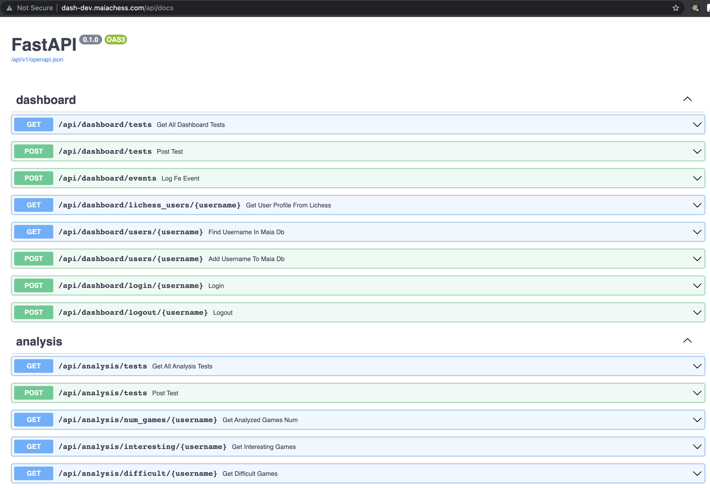

# Maia Dashboard / anti-semicolon-semicolon-club

 > _Note:_ This document is meant to be written during (or shortly after) your review meeting, which should happen fairly close to the due date.      
 >      
 > _Suggestion:_ Have your review meeting a day or two before the due date. This way you will have some time to go over (and edit) this document, and all team members should have a chance to make their contribution.

## Iteration 02 - Review & Retrospect

 * When: Thursday, October 28 @3pm
 * Where: PT266, UofT

## Process - Reflection

#### Q1. Decisions that turned out well

List **process-related** (i.e. team organization and how you work) decisions that, in retrospect, turned out to be successful.

 * 2 - 4 decisions.
 * Ordered from most to least important.
 * Explain why (i.e. give a supporting argument) you consider a decision to be successful.
 * Feel free to refer/link to process artifact(s).
 
 #### Division into `frontend` and `backend` sub-teams
 It was a great decision to divide our team into `frontend` and `backend` sub-teams, 
 each of which had their meetings and work planning separately 
 (in addition to weekly team meetings and weekly meetings with the partner). 
 This allowed us to share responsibilities efficiently and develop the frontend and backend in parallel. 
 
 Working in sub-teams helped us to concentrate on our own part of work 
 and discuss backend / frontend implementation in more details during sub-team meetings, 
 rather than if we did it during a general team meeting. 
 
 Also, this division created a bigger sense of ownership because each sub-team was solely responsible for their part.    

 #### Drafting API documentation before implementing API
 Before implementing API we drafted its documentation to agree on how the frontend and backend will communicate.
 This was a good decision because it allowed frontend and backend developers to not be dependent on each other:
 once we agreed on the API abstraction, each sub-team could develop their part on their own 
 without being blocked by another sub-team.
 
 In addition, drafting the API documentation before developing the API helped to clarify requirements with the partner.
 

 #### Choosing the tech stack based on the Partner's preference
 Although our team is more familiar with the Django framework and relational databases (e.g. PostgreSQL)
 and wanted to use technologies which we already know,
 the Partner asked to implement the project with FastAPI (instead of Django) and MongoDB (instead of PostgreSQL).
 The team agreed to use the tech stack preferred by the Partner, which turned out to be a good decision because
 it allowed the Partner to actively participate in the project planning. 
 Because after December 2021 the Partner will be working on the project 
 and will have to maintain the project without the team, it is crucial that 
 the Partner understands and agrees with the project's structure and, especially, the Rest API part
 (because the Dashboard API that we are building will be re-used for other Maia projects in the future). 
 
 
#### Q2. Decisions that did not turn out as well as we hoped

List **process-related** (i.e. team organization and how you work) decisions that, in retrospect, were not as successful as you thought they would be.

 * 2 - 4 decisions.
 * Ordered from most to least important.
 * Explain why (i.e. give a supporting argument) you consider a decision to be unsuccessful
 * Feel free to refer/link to process artifact(s).

 #### Not following on our plan to do daily stand up meetings
 Although we planned to have daily 15-minute stand up meetings once we start developing,
 in the reality we did not follow through with this plan due to the lack of time. 
 
 The decision to skip daily stand up meetings results in developers forgetting about their personal deadlines 
 without an additional reminder at a stand up meeting.

 #### Not assigning a team member responsible for meeting minutes
 In the beginning of the project our team decided to rotate the responsibility of writing meeting minutes between all team members instead of assigning it to one team member. 
 As a result of this, the task of writing meeting minutes fell through the cracks. 
 For example, the meeting minutes for 2021-10-14 and 2021-10-21 meetings with the partner were actually 
 written by one of the team members on October 25. 
 These meeting minutes are based on memories of what happened at the meetings 
 instead of being written during the meetings, which is not optimal.

#### Q3. Planned changes

List any **process-related** (i.e. team organization and how you work) changes you are planning to make (if there are any)

 * Ordered from most to least important.
 * Explain why you are making a change.

Most of the process-related planning up to deliverable 2 has worked out well. Our team has found time to setup meetings with the partner as well as brief meetings on Tuesday in which
the individual members can discuss their progress and future plans. We have also setup a Slack to which we have dynamically added channels (e.g. frontend/backend) to further improve our
workflow and communication. However, there do exist some minor issues which we plan to improve upon. From most to least important:

### Improve the team's interaction with Trello
As of now we are creating "tickets" on Trello to organize which team members tackle which functionalities. Although this has allowed us to keep track of which tasks need working on, members did
not always update their ticket state (e.g from in development to finished). This ended up causing some confusion as member's could not track other's progress as intended.

### Improve meeting minutes
We had planned but did not follow through with writing meeting minutes on a rotational schedule. We will work on a way to notify team members who are responsible for given meetings. 
This could improve the quality of notes and make it harder to overlook specific requests made by the partner. 

### Simplify the Slack channel list
As of now our team uses Slack for communication. The many themed channels allow us to organize our questions, comments and information. However, there do exist several channels which we have made
little to no use of. We believe removing redundant channels could make tracking messages on Slack even easier. 

## Product - Review

#### Q4. How was your product demo?
 * How did you prepare your demo?
 * What did you manage to demo to your partner?
 * Did your partner accept the features?
 * Were there change requests?
 * What did you learn from the demo from either a process or product perspective?
 * *This section will be marked very leniently so keep it brief and just make sure the points are addressed*
